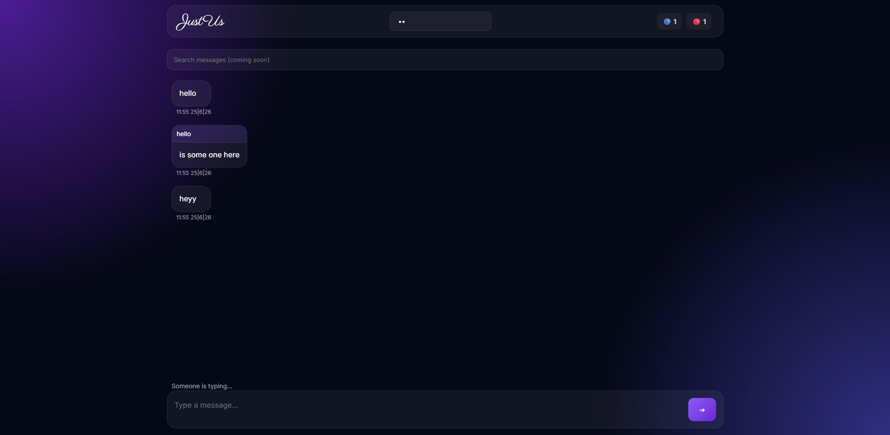
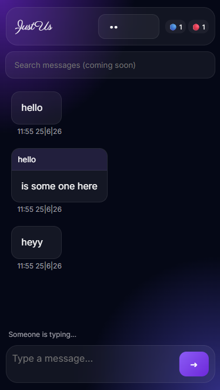

# 💬 JustUs – Secure Real-Time Chat App

JustUs is a modern, real-time encrypted chat application built using Firebase and AES encryption. It allows users to join private chat rooms using a room number, where all messages are securely encrypted and synced instantly.

---

## 🚀 Features

- ⚡ Real-time messaging using Firebase Realtime Database  
- 🔐 AES encryption for secure communication  
- 🏠 Room-based chat system (unique room keys)  
- 🎨 Clean, modern, responsive UI  
- 🌙 Theme/custom UI controls (if enabled in your build)  
- 🧹 Message clearing feature  
- ⏳ Smooth loader / UX enhancements  

---

## 🛡️ Security

All messages are encrypted on the client side using AES before being sent to Firebase.  
Each chat room uses a unique key that acts as the encryption seed, ensuring that only users with the correct room ID can read messages.

---

## 🛠️ Tech Stack

- HTML5  
- CSS3 / Tailwind CSS  
- JavaScript (ES6+)  
- Firebase Realtime Database  
- CryptoJS (AES Encryption)

---

## 📸 Preview

## Screenshots

### Desktop Preview

### Mobile Previe

---

## 📂 How It Works

1. User enters a **room number**
2. A unique encryption key is generated/used
3. Messages are encrypted using AES
4. Firebase stores encrypted messages
5. Other users in the same room decrypt and view messages in real time

---

## 💡 Future Improvements

- Firebase Authentication (user accounts)
- End-to-end encryption upgrade
- Media sharing (images/files)
- Message timestamps + read receipts
- Mobile app version

---

## 👨‍💻 Developer

Developed with by **Bhagyam Pathak**

---

## 📌 Note

This project is built for learning and showcasing real-time web development + encryption concepts.
